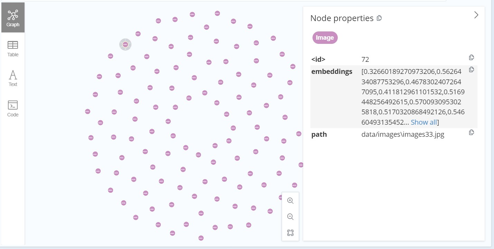
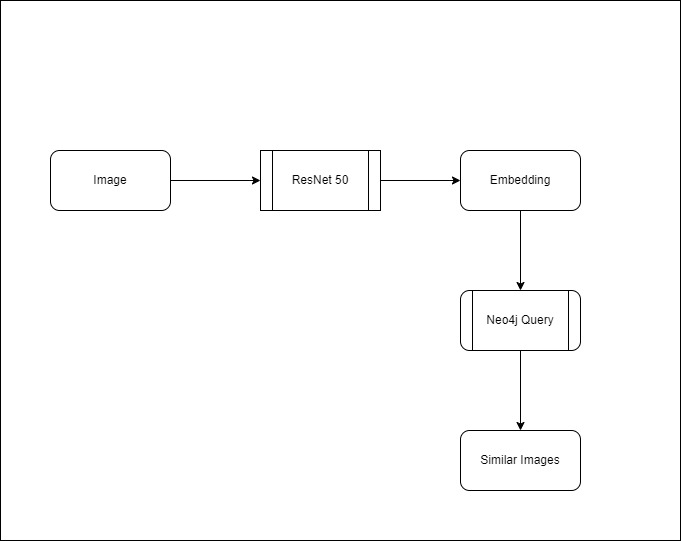

# Utilizing Embeddings and Neo4j for Efficient Image Retrieval

## Introduction

Image retrieval involves finding images similar to a given query image within a large dataset. Traditional image retrieval methods often rely on comparing pixel values directly, which can be inefficient and ineffective. Utilizing embeddings and cosine similarity offers a more efficient and accurate approach. Embeddings are lower-dimensional representations of images that capture their features, and cosine similarity measures the similarity between these embeddings. This enables faster and more accurate retrieval of similar images.


### Importance of Efficient Image Retrieval
Efficient image retrieval is crucial in various domains, including e-commerce, content sharing platforms, healthcare, and more. It allows users to quickly find visually similar images, aiding in product recommendations, content curation, medical image analysis, and more. By improving retrieval speed and accuracy, businesses can enhance user experiences, increase engagement, and make better-informed decisions based on image data.

The following approach have 2 parts:

## Part -1 

## Generating Embeddings and Storing Data in Neo4j

## 1. Data Preparation. 

For simplicity, I scraped few car images from google and stored them in a folder called `images`. The images are stored in the `.jpg` format.
```python
preprocess = transforms.Compose([
    transforms.Resize(256),
    transforms.CenterCrop(224),
    transforms.ToTensor(),
    transforms.Normalize(mean=[0.485, 0.456, 0.406], std=[0.229, 0.224, 0.225]),
])
```

Pretrained networks works well if we resize the images to it input layer size when we are generating embeddings. In this case, we will be using ResNet50, which takes in images of size 224x224. We will be resizing the images to this size before generating embeddings.

Post resizing, we will normalize the images using the mean and standard deviation of the ImageNet dataset. This is done to ensure that the images are in the same format as the images used to train the network.

## 2. Generating Embeddings

For embedding generation, we will be using a pre-trained model called ResNet50. ResNet50 is a convolutional neural network that is 50 layers deep. Its skip connections make it easier to train than a similarly deep plain network. It is trained on more than a million images from the ImageNet database. The network is trained to classify images into 1000 object categories. We will be using the network to generate embeddings for our images.

Model loading 
```python
model = models.resnet50(pretrained=True)
model = nn.Sequential(*list(model.children())[:-1]) 
```

```python
def get_image_embeddings(image_path):
    img = Image.open(image_path).convert('RGB')
    img = preprocess(img)
    img = img.unsqueeze(0)  # Add batch dimension
    with torch.no_grad():
        embeddings = model(img)
    return embeddings.squeeze().numpy()
```

## 3. Storing Data in Neo4j

We will be using Neo4j to store the embeddings and the image paths. Neo4j is a graph database that allows us to store data in the form of nodes and relationships. We will be storing the embeddings as node properties and the image paths as node labels. We will also be creating a relationship between the embeddings and the image paths. This will allow us to query the database for similar images.

```python
from neo4j import GraphDatabase

# Connect to the Neo4j database
uri = "<neo4j_bolt_url>"
username = "<neo4j_username>"
password = "<neo4j_password>"

class Neo4jDatabase:
    def __init__(self):
        self._driver = GraphDatabase.driver(uri, auth=(username, password))

    def close(self):
        self._driver.close()

    def create_image_node(self, embeddings,path):
        with self._driver.session() as session:
            session.write_transaction(self._create_image_node, embeddings,path)

    @staticmethod
    def _create_image_node(tx, embeddings,path):
        query = (
            "CREATE (img:Image {embeddings: $embeddings,path: $path})"
        )
        tx.run(query, embeddings=embeddings,path = path)
```

After the data insertion, the graph looks like this:




## Part -2

## Retrieving Similar Images




